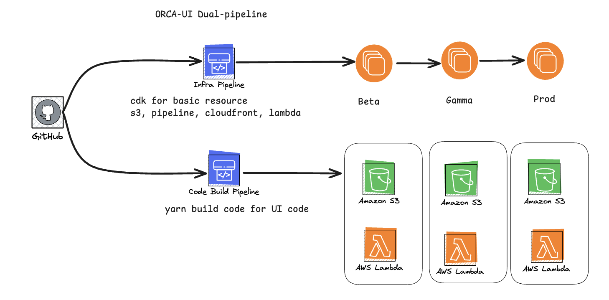

# OrcaUI Deployment

The IaC for the deployment of IaC is in AWS CDK.

## Overview

The React application is deployed using AWS CloudFront and S3, utilizing a custom subdomain prefixed with `orcaui` and appended with the respective domain name within their AWS account. Deployment is managed within the toolchain (build) account, enabling the stack to be deployed across multiple accounts.

For each account, the React assets are built and then pushed to a designated S3 bucket using AWS CodeBuild and Lambda functions. Specifically, a Lambda function uploads the assets to S3 and subsequently triggers CodeBuild. CodeBuild then compiles the React application and uploads the built assets back to S3.

## Deployment Strategy

The deployment strategy is to deploy the React application to the toolchain account, and then use AWS CodePipeline to deploy the application to the respective accounts.


## env config lambda

The env config lambda is used to update the env.js file in the S3 bucket. Env Config Lmabda [here](./lambda/env_config_and_cdn_refresh.py)

Normally, the lambda function is invoked by the CodeBuild project. This is done by adding a code build action in the CodeBuild project to invoke the lambda function.

If you want to invoke the lambda function manually, you can use the following command (without payload):

```sh
aws lambda invoke \
    --function-name CodeBuildEnvConfigLambdaBeta \
    response.json
```

if you wanna invoke manually with payload to update the api version, you can use the following command:

```sh
aws lambda invoke \
    --function-name CodeBuildEnvConfigLambdaBeta \
    --payload '{"metadata_api_version": "v2"}' \
    response.json
```

Update multiple API versions

```sh
aws lambda invoke \
    --function-name CodeBuildEnvConfigLambdaBeta \
    --payload '{
        "metadata_api_version": "v2",
        "workflow_api_version": "v2",
        "sequence_run_api_version": "v1",
        "file_api_version": "v2"
    }' \
    response.json
```

invoke with a specific AWS profile:

```sh
aws lambda invoke \
    --profile your-profile-name \
    --function-name CodeBuildEnvConfigLambdaBeta \
    --payload '{"metadata_api_version": "v2"}' \
    response.json
```

## Development

Change to the deploy directory

```sh
cd deploy
```

Install the dependencies

```sh
yarn install
```

To deploy the cdk

```sh
yarn cdk deploy
```

To test cdk resources in compliance with `cdk-nag`

```sh
yarn test
```
